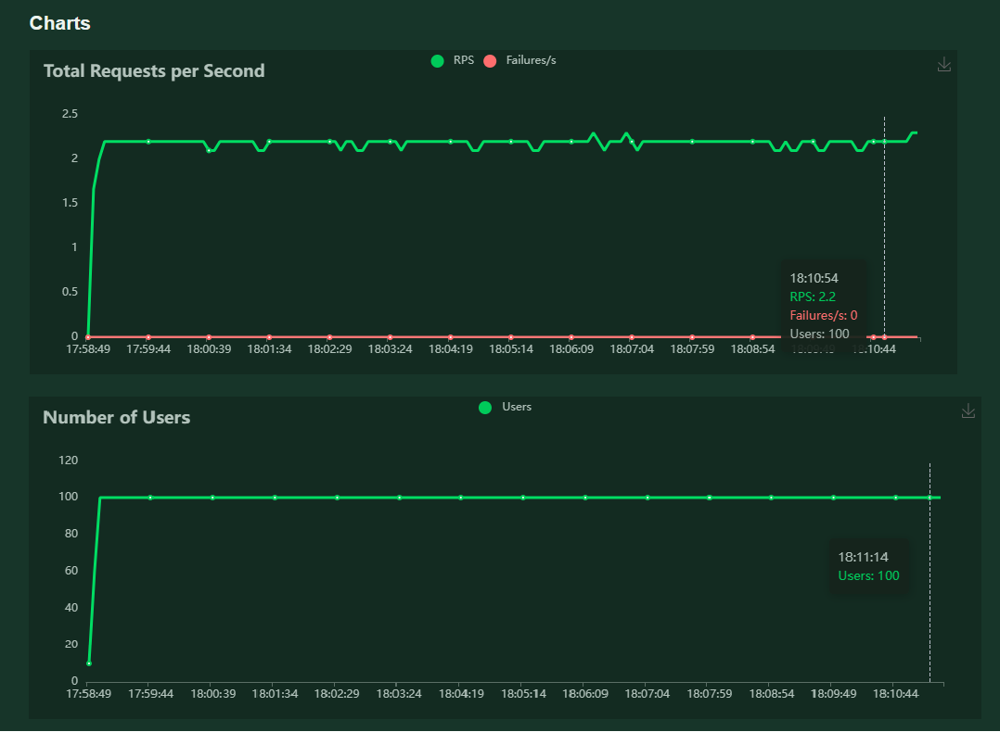

## License
This project is licensed under the MIT License - see the [LICENSE](LICENSE) file for details.

# Sistema de QC precipitaciones con DeepLearning  (Version 1.0.0)
Proyecto para realizar QC de precipitacion.

> El proyecto tiene un proceso asincrono que se ejecuta cada 10 min. Este proceso descarga (en caso no se tenga aún) las imagenes satelitales de la ultima hora. 

A pesar que el proyecto esta estructurado para analizar las preciptiaciones mas recientes, tambien se peude probar con fechas antiguas, sin embargo la primera vez demorara en descargar las imagenes satelitales, estas imagen se guardan en una carpeta de manera temporal, en caso se necesite especificar el espacio maximo a utilizar en el almacenamiento temporal, los parametros están en utils/config.py.

## 1. Esctructura del proyecto  
**La estructura base será:**  

base_dir/  
├───📁 utils/  
│   └───📄 config.py  
│   └───📄 goes.py  
│   └───📄 logs.py  
│   └───📄 model.py  
│   └───📄 predict.py  
    ...  
├───📄 main.py  
├───📄 req.txt  
├───📄 app_logs.log 
├───📄 test.py  
├───📁 imagenes/  
├───📁 models/  
├───📁 static/  
├───📁 templates/  
       ....  

## 2. Instalacion
El servicio web esta desarrollado en Flask 3.1.0 en la version de Python 3.10.1. 
Las librerias necesarias estan en el archivo req.txt, para su instalacion se puede seguir los siguientes pasos.

- 1. Instalar python > 3.10.1
- 2. Instalar las librerias utilizando CMD con el comando 
    > pip install -r req.txt
- 3. Inicar el servicio utilizando CMD con el comando
    > python main.py

## 3. Uso
El uso del API principal sera BASE_URL/predict/< fecha >/< estacion >/< dato >

> e.g BASE_URL/predict/2022-02-01-07-00/X47E0D438/1.2

## 4. Responses
El API **/predict** retomaran un diccionario (json) con el siguiente campos (respetando minúsculas):
- **Flag** : Indica si es malo (M), conforme (C) o NC (no corresponde).
- **Message**: Mensaje de advertencia o error.
- **Probability** : Probabilidad de ser conforme el dato (de 0 a 1).
- **Status** : True si el proceso se ejecuto correctamente, caso contrario False.
- **color** : Color subjetivo que indica el Flag (C=Verde ,M=Rojo, NC=Naranja)
- **parametros** : Parametros que utilizo el modelo para su prediccion. 
    - **Dato** : Valor de precipitacion en mm/h
    - **Fecha** : Fecha en que sucedio la precipitacion 
    - **Latitud** : Latitud de la estacion
    - **Longitud** : Longitud de la estacion
    - **Altitud** : Altitud de la estacion
    - **per90** : percentil 90 de los datos de precipitacion en la estacion

## 5. Logging
Los logging se realizaran con logging de python. Se guardará en un archivo app_logs.log, además se imprimiran en la consola. **Los logging se colocarán despues de la logica que hace referencia**
El formato basico de los archivos de log tendrá 
> FECHA - NIVEL_DEGUB - Mensaje
 

Existen 5 niveles de Logging **info,debug,warning,error,critical**. Todas las vistas tendrán minimo estos logging:
- Al inicio de la peticion (request) el middleware hará logging (info) del nombre de la consulta con un ID asignado. 
- Al final de la peticion el middleware hará logging (info) con la metada generada de la peticion.
- En caso de excepciones no mapeadas en el request, el middleware capturará la expcecion y generará un logging (critical), para así evitar que el backend deje de funcionar.

## 6. Pruebas
Se han desarrolado las pruebas unitarias y las pruebas de estrés con exito, se muestra los resultados de las pruebas de estres realizado en locust

